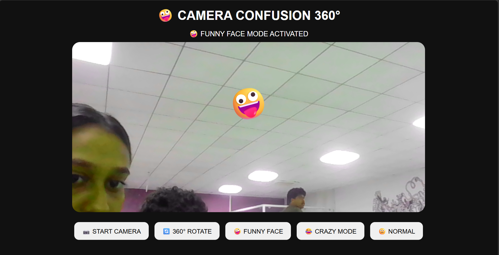
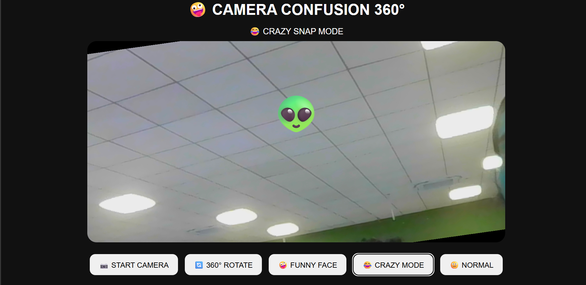
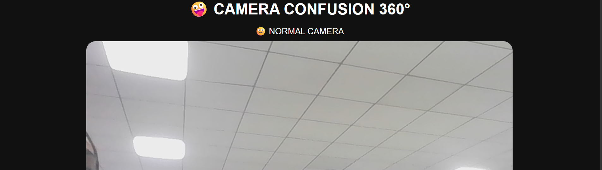
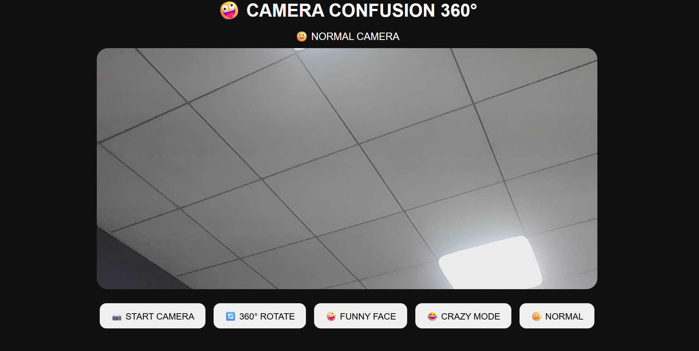

# 360 degree head rotate camera 🎯

## Basic Details
### Team Name: Cherish

### Team Members
- Team Lead: Keerthika.M - jain university
- Member 2: Hareeshma.H - jain university
  

### Project Description
A Fun and useless webcam project that creates the illusion of a 360degree rotating head

### The Problem (that doesn't exist)
humans can only move their heads within a limited range their is no button that let us rotate our head completely around so we decided to solve this extremely unnecessary around

### The Solution (that nobody asked for)
The application uses the webcam to detect a person's face. When the user activates the effect, the detected face is visually rotated and flipped through different angles, creating a funny simulation of a 360° head rotation.
The person's actual head doesn't move—the effect is entirely generated on the screen.

## Technical Details
### Technologies/Components Used

For Software:
Python
OpenCV
NumPy
Tkinter
Webcam

For Hardware:
📷 Live webcam feed
🙂 Face detection
🔄 360° rotation simulation
🤪 Funny face effect
🖥️ Real-time display
▶️ Start/Stop controls

### Implementation
For Software:
# Installation
# 1. Clone or download this project folder, then open your terminal inside it.

# 2. Install all the required Python libraries at once:
pip install -r requirements.txt

# Run
python '360 degree rotate head camera'

### Project Documentation
For Software:

# Screenshots 

*home screen of our page*

*this shows a funny face with a colour change*

*this shows a funny face with an emoji *

*shows our real face *

### Project Demo
# Video
https://drive.google.com/drive/folders/1J0DHUZQAyYDZLNJvhq3VOGux7SHf8mqu?usp=sharing

*This is  our website named  360 degree head  rotate we used python language to create this, and have 5 options in our front end, we put chaos and comicals in this to make this useless, we have a 360 degree rotate camera  funny face, crazy mode, normal mode

# Additional Demos
[Add any extra demo materials/links]

## Team Contribution]: [Specific contributions]
- [keerthika.m]: [coding]
-[ hareeshma.H]: [DESIGNING]

---
Made with ❤️ at TinkerHub Useless Projects 

